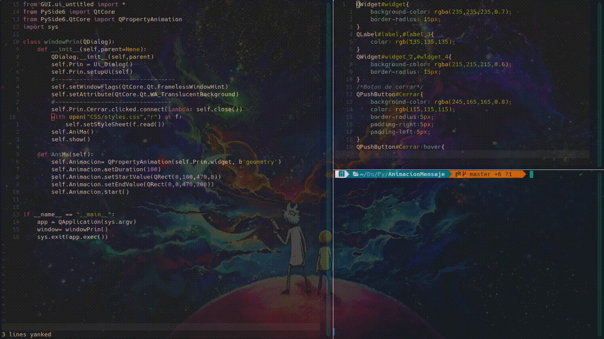

#proyecto **Animacion de Mensaje**

En este proyecto se muestra la animacion de tipo de mensage utilizando PySide6 con la propiedad
> **QPropertyAnimation** para animar la ventana
Como se muestra en el siguiente codigo

---

```python
    def AniMa(self):
	self.Animacion= QPropertyAnimation(self.Prin.widget, b'geometry')
        self.Animacion.setDuration(150)
        self.Animacion.setStartValue(QRect(0,100,470,0))
        self.Animacion.setEndValue(QRect(0,0,470,200))
        self.Animacion.start()
```
* En el archivo main.py

Usa **with** para abrir el archivo styles.css que se aplica a la cclase windoPrin
---
```python
    with open("CSS/styles.css","r") as f:
	self.setStyleSheet(f.read())
```

